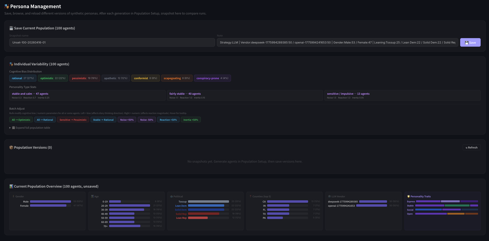
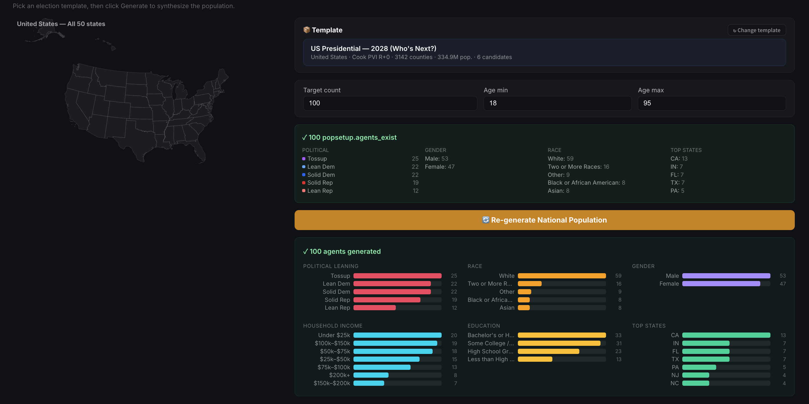
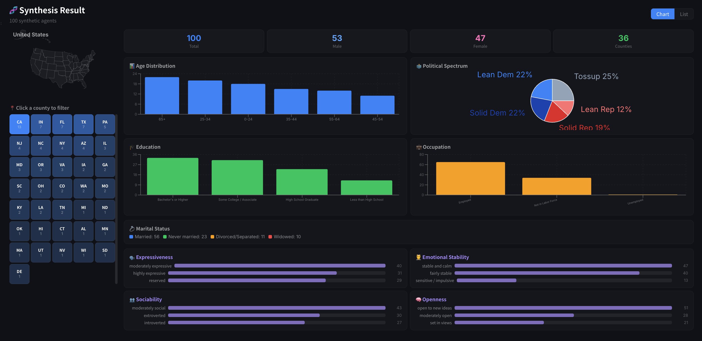
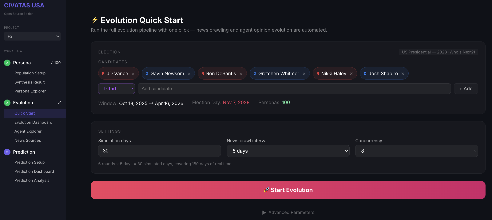
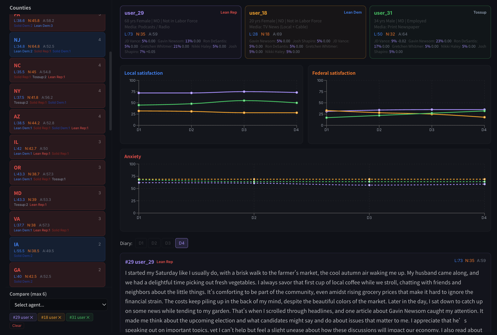
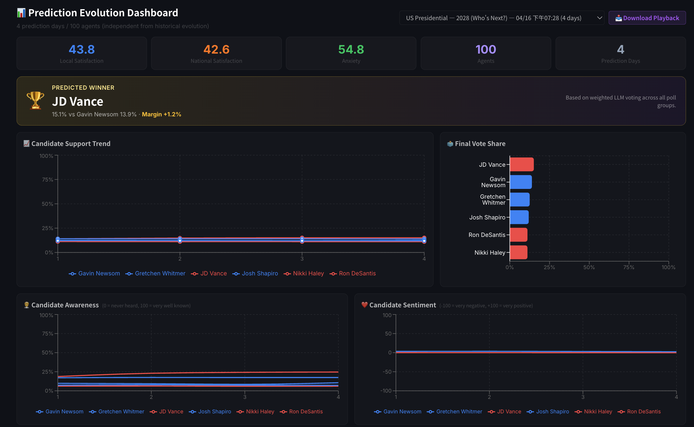
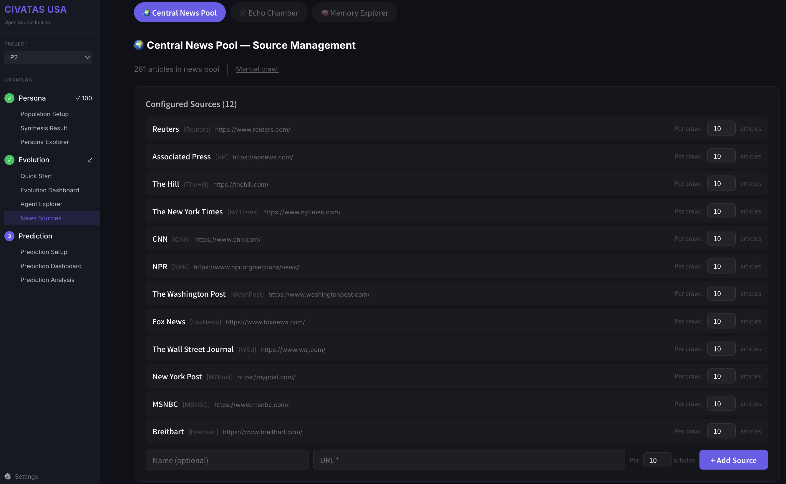
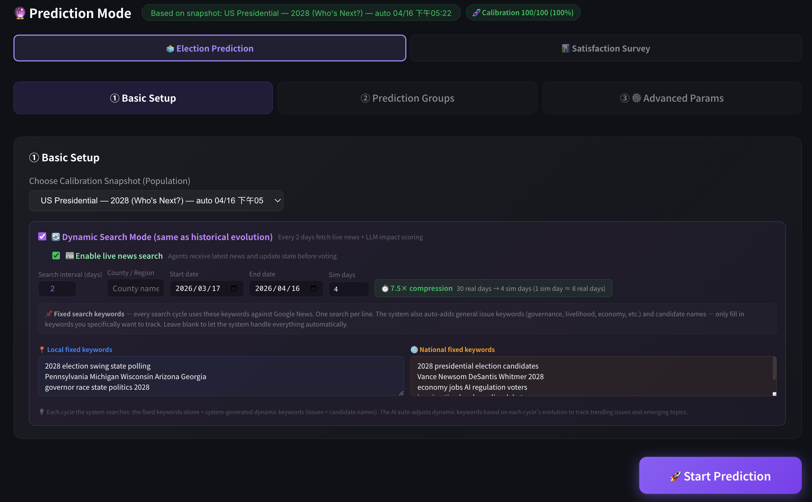
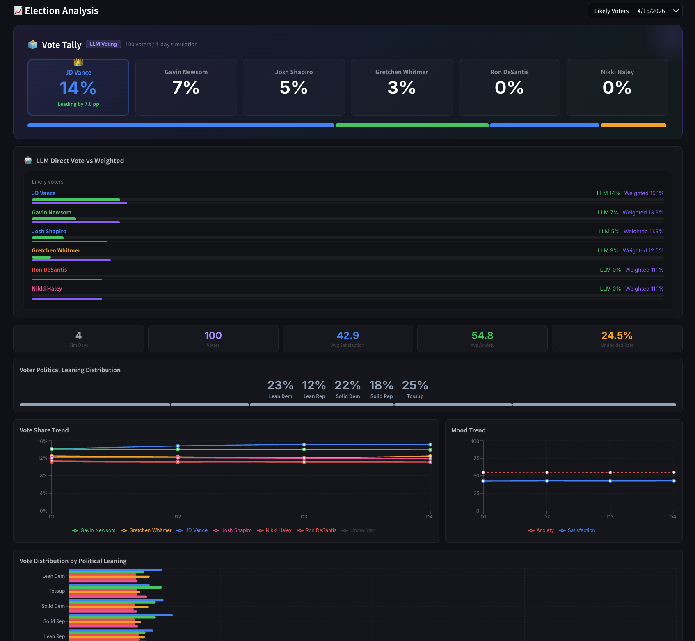
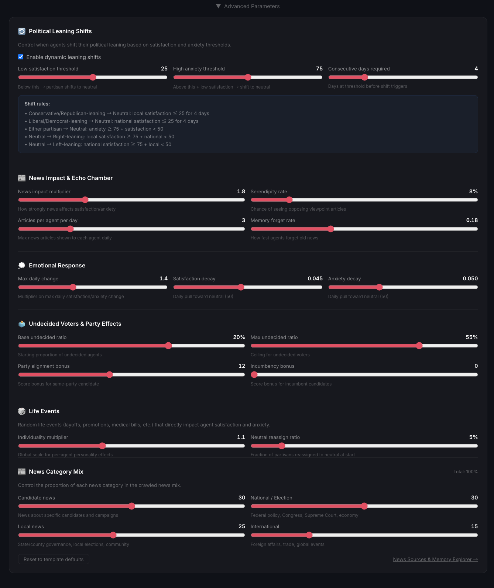

# 🗳️ Civatas USA

> **Civatas is SimCity for elections.**  
> Build 1,000 Americans from Census data. Feed them 30 days of real news. Watch their opinions shift. Run the 2028 race — before it happens.

[](LICENSE)
[](ap/docker-compose.yml)
[](https://ch-neural.github.io/Civatas-USA/demo/)

---

## 🎯 Live Demo — 2028 Presidential Election

We ran a full simulation of the **2028 US Presidential Race** (*JD Vance vs Gavin Newsom vs Ron DeSantis vs Gretchen Whitmer vs Nikki Haley vs Josh Shapiro*) using 100 AI-powered voter agents and 30 days of real news.

| | |
|---|---|
| 📈 **[Evolution Playback](https://ch-neural.github.io/Civatas-USA/demo/2028-evolution.html)** | Watch 100 voters' opinions shift day by day as real news breaks |
| 🗳️ **[Prediction Results](https://ch-neural.github.io/Civatas-USA/demo/2028-prediction.html)** | Final Electoral College result: who wins in 2028? |

---

## 🧠 How It Works

Civatas USA is a **three-stage pipeline** that transforms US Census data into election predictions:

```
📊 Census Data (ACS)
      ↓
👥 Stage 1 — PERSONA GENERATION
   Synthesize realistic American voters (demographics, income, race, education, location)
      ↓
📰 Stage 2 — OPINION EVOLUTION
   Feed agents real news daily. Watch them react, write diaries, shift political leanings.
      ↓
🗳️ Stage 3 — PREDICTION
   Simulate voting day. Aggregate by Electoral College. Call the winner.
```

Every agent is a **fully realized American**:
- Drawn from ACS 2024 census distributions (gender, age, race, income, education, geography)
- Assigned a personality (stable vs. anxious, optimistic vs. pessimistic, conformist vs. independent)
- Given a political leaning calibrated to **Cook Political Report PVI** county data
- Powered by an LLM that reads news, writes daily diary entries, and votes

---

## 🗓️ The 2028 Story: From First Headlines to Election Night

*This is not a poll. This is a simulation. 100 Americans woke up every morning, read the news, argued with themselves in their diaries — and eventually voted.*

### Meet the Voters



Among our 100 simulated Americans:

**Maria, 34, Houston TX** — Second-generation Mexican-American, call center supervisor, \$50k–\$75k income. Every morning she clocks in at the call center. She reads about immigration enforcement and feels torn — her family's story, her American identity. By Day 15, her anxiety is climbing toward 63.

**James, 58, Mesa AZ** — White, retired electrician, Lean Republican. Scorching Mesa mornings, coffee before the news. Reads about JD Vance's Michigan visit and nods along. Local satisfaction: 42. National? He's watching.

**Priya, 27, New York NY** — Asian-American, graduate student, Q-train commuter. Reads about Josh Shapiro's AI deepfake legislation in Pennsylvania. Finds it surprisingly reasonable. Writes: *"Another morning pressed against strangers on the Q train..."*

**Earl, 67, rural Indiana** — White, fixed income, Solid Republican. I-69 commuter, same route every Tuesday. When Whitmer's name comes up in Michigan news, he pays attention — and not favorably.

**Sofia, 22, Fresno CA** — Hispanic, community college student. Local satisfaction: 16 (housing crisis). National satisfaction: 94 (excited about federal politics). Shapiro's bipartisan record resonates.

---

### Stage 1: Building the Population





Civatas generates synthetic Americans from real Census distributions — not random profiles, but statistically accurate cross-sections of the US population. Select a template and the system builds your voter pool from ACS data: the right proportions of age, race, income, education, and geography.

For the 2028 simulation, 100 agents spanning all political leanings:
- **Solid Dem**: 22 agents (CA, NY, IL strongholds)
- **Lean Dem**: 22 agents (college-educated suburbs)
- **Tossup**: 25 agents (the true battleground)
- **Lean Rep**: 12 agents (exurban Midwest)
- **Solid Rep**: 19 agents (deep South, rural)

---

### Stage 2: 30 Days of Real News



Every simulation day, Civatas searches for **real news** using the Serper API — headlines about each candidate, national policy, local issues, international events. Each agent reads 3 articles matched to their media habits and political diet.

Then comes the diary.

**Day 7 — James (Mesa AZ, Lean Rep):**
> *"Another scorching Mesa morning. Got the news on while making eggs. Vance was up in Michigan talking about election integrity — that's exactly the kind of thing I want to hear from someone in the White House. Local 42, National 47."*

**Day 12 — Maria (Houston TX, Tossup):**
> *"Another long shift at the call center. On break, saw the news about the SAVE America Act. The voting restrictions stuff scares me. My abuela had such a hard time getting her ID renewed last year. Anxiety creeping up."*

**Day 18 — Priya (NYC, Lean Dem):**
> *"The Shapiro deepfake bill passed committee. I know it's Pennsylvania, not federal, but it feels like someone actually understands technology for once. Sat 61, Anxiety 44 — lower than usual. Hopeful day."*



**Three political shifts occurred** during our 30-day evolution:

| Agent | Shift | Trigger |
|-------|-------|---------|
| Voter #41 | Tossup → **Lean Rep** | Strong approval of local Republican governance |
| Voter #53 | Solid Rep → **Tossup** | Local satisfaction collapsed to 17; couldn't reconcile party loyalty with local failures |
| Voter #57 | Tossup → **Lean Dem** | Federal policy news consistently resonated positively |



**Candidate awareness** over 30 days:

| Candidate | Day 1 | Day 30 | Trend |
|-----------|-------|--------|-------|
| JD Vance | 18.7% | 24.6% | 📈 Rising — incumbent VP visibility |
| Gavin Newsom | 17.1% | 17.4% | ➡️ Steady |
| Gretchen Whitmer | 9.8% | 10.6% | 📈 Late surge — Michigan news cycle |
| Josh Shapiro | 7.3% | 7.1% | ➡️ Steady — PA-focused |
| Ron DeSantis | 6.1% | 6.2% | ➡️ Flat |
| Nikki Haley | 6.6% | 6.0% | 📉 Fading |

### One Headline, Five Reactions

This is what makes Civatas a *simulation* rather than a poll — the **same news story triggers opposite reactions** depending on who's reading it.

**Headline: *"VP JD Vance talks federal election involvement during Michigan visit"* (Day 7)**

| Voter Group | Agents | Satisfaction Δ | Anxiety Δ | Vance Awareness |
|-------------|:------:|:--------------:|:---------:|:---------------:|
| Solid Rep   | 19     | **+5.8**       | −1.8      | +4.1%           |
| Lean Rep    | 12     | **+3.4**       | +1.2      | +3.6%           |
| Tossup      | 25     | −0.8           | +5.2      | +2.9%           |
| Lean Dem    | 22     | −2.9           | **+9.1**  | +1.9%           |
| Solid Dem   | 22     | −6.4           | **+13.8** | +0.8%           |

Republican agents heard their VP pick deliver exactly the message they wanted. Tossup voters felt the tension of a divisive topic. Solid Dem voters read the same headline and reacted with near-alarm. **One story. Five different Americas.**

The polarization is structural, not random: every agent has a `party_align_bonus` that amplifies same-party signals and a `media_habit` dimension (Fox News / NPR / Reddit / Facebook / Print) that shapes which version of a story they see. A Solid Rep agent on Fox's diet never encounters the Lean Dem reading of the same event.

---

**Headline: *"U.S. added 178,000 jobs in March"* (Day 14)**

Economic news cuts along a different axis — **income bracket**, not party lean:

| Income Bracket | Satisfaction Δ | Anxiety Δ | What the agent is feeling |
|----------------|:--------------:|:---------:|---------------------------|
| Under $25k     | +0.4           | **+7.2**  | *"Jobs in the headline don't pay my rent"* |
| $25k – $75k    | +3.1           | +2.8      | Cautious optimism          |
| $75k – $150k   | **+5.4**       | −1.2      | Economic stability = security |
| $150k+         | +2.1           | −0.9      | Already secure; mild relief |

Low-income agents carry a built-in higher anxiety sensitivity to economic news — the model captures the gap between macro headlines and household reality. The same jobs report that reassures a suburban professional quietly frightens a call-center worker living paycheck to paycheck.

---

These per-group reactions compound across 30 days. Vance's repeated visibility in swing-state news drove his awareness from **18.7% → 24.6%**. Whitmer's Michigan tax-relief story on Day 28 produced her late awareness bump. Every point in the candidate table above has a traceable news cause.



**National mood** stabilized at:
- Satisfaction: **42.9 / 100** *(real news is rarely cheerful)*
- Anxiety: **54.8 / 100** *(election season tension is real)*

---

### Stage 3: Voting Day



After 30 days of evolution, we ran a **4-day prediction window** using the latest real news. Each agent voted based on their evolved opinions, personality, and candidate awareness.



**🏆 Final Results — 2028 Presidential Prediction:**

| Candidate | Party | Popular Vote | Electoral Votes |
|-----------|-------|:-----------:|:--------------:|
| 🏆 **JD Vance** | Republican | **15.1%** | **308 EV ✓ wins** |
| Gavin Newsom | Democrat | 13.9% | 147 EV |
| Gretchen Whitmer | Democrat | 12.5% | 16 EV |
| Josh Shapiro | Democrat | 11.9% | 3 EV |
| Ron DeSantis | Republican | 11.1% | — |
| Nikki Haley | Republican | 11.1% | — |
| ⚪ Undecided | — | 24.5% | — |

*Coverage: 474/538 Electoral Votes (88% of states have agents)*

> **Bottom line: JD Vance wins with 308 Electoral Votes.**
>
> But 24.5% of voters remain undecided — in a six-way race, that's the real story. The Democratic vote is split three ways between Newsom, Whitmer, and Shapiro. Whitmer's late surge and Shapiro's bipartisan appeal are real — but fragmented Democratic support hands the race to Vance.

---

## ⚠️ Want More Accurate Results?

Our 100-agent demo is a **proof of concept**. For reliable Electoral College predictions:

| Parameter | Demo Run | Recommended |
|-----------|:--------:|:-----------:|
| **Agent count** | 100 | **1,000+** |
| **Why** | ~3 agents/state → one model response flips a state | ≥20 agents/state stabilizes results |
| **Evolution days** | 30 | 60–90 (full campaign cycle) |
| **Prediction days** | 4 | 7–14 (capture late-breaking news) |
| **LLM vendors** | 2–3 | 3–4 (reduces individual model bias) |

With 1,000+ agents, each major state gets sufficient sample size to make Electoral College projections meaningful. Popular vote accuracy is already strong at 100 agents — Electoral College accuracy requires volume.

---

## 🚀 Quick Start

### Prerequisites
- Docker & Docker Compose
- LLM API key (OpenAI, DeepSeek, or any OpenAI-compatible API)
- [Serper API key](https://serper.dev) (for real news search — free tier available)

### Install & Run

```bash
git clone https://github.com/ch-neural/Civatas-USA.git
cd Civatas-USA/ap
cp .env.example .env
cp shared/settings.example.json shared/settings.json
# Edit shared/settings.json — add your LLM and Serper API keys
docker compose up --build
```

Open **http://localhost:3100** — the onboarding wizard walks you through everything.

### Onboarding Wizard (5 minutes)
1. **API Keys** — Add LLM provider + Serper key. Click **Test** to verify each.
2. **Create Project** — Pick a template (try *2028 Who's Next?*)
3. **Generate Personas** — Watch Americans come to life
4. **Quick Start Evolution** → **Prediction** — See who wins

---

## 🗺️ Available Templates

### National Templates

| Template | Candidates | PVI Source | Best For |
|----------|------------|-----------|----------|
| **Generic D vs R vs I** | Configurable | 2020+2024 | Custom candidate scenarios |
| **2024 Trump vs Harris** | 2 | 2016+2020 (no data leakage) | Backtesting against real results |
| **2028 Who's Next?** | 6 (Vance/Newsom/DeSantis/Whitmer/Haley/Shapiro) | 2020+2024 | Current forward-looking simulation |

### State Templates (51 total)
Every US state + DC — with state-level PVI, county distributions, and local news focus. Run Pennsylvania alone, Michigan vs Wisconsin, or all 50 states at once.

### Custom Templates
Define your own candidates, party affiliations, incumbency, local keywords, and calibration parameters. Supports presidential, senate, gubernatorial, house, and mayoral elections.

---

## ⚙️ Advanced Configuration



Fine-tune 24 parameters across 6 categories in the **Advanced Parameters** panel:

| Category | Key Parameters |
|----------|---------------|
| **Political Leaning Shifts** | Satisfaction/anxiety thresholds for when voters change party lean |
| **News Impact & Echo Chamber** | How much each article moves opinion; serendipity rate |
| **Emotional Response** | Satisfaction/anxiety decay; negativity bias correction |
| **Undecided & Party Effects** | Base undecided rate; incumbency bonus; party alignment strength |
| **Life Events** | Random life events (job loss, health scare, community news) |
| **News Category Mix** | % split: candidate / national / local / international news |

---

## 🏗️ Architecture

9 Docker services, fully self-hosted:

```
upload → ingestion(8001) → synthesis(8002) → persona(8003) → social(8004)
       → adapter(8005) → simulation(8006) → analytics(8007)
              ↑                                    ↑
         api(8000) FastAPI              web(3000) Next.js
```

All data stays on your machine. No telemetry. No cloud dependency beyond LLM API calls.

---

## 📊 Data Sources

| Data | Source | Coverage |
|------|--------|----------|
| Demographics | US Census ACS 2024 (via censusreporter.org) | 50 states + DC, 3,000+ counties |
| Elections | MEDSL 2016/2020/2024 | County-level presidential results |
| Political lean | Cook Political Report PVI methodology | 5 buckets: Solid D → Solid R |
| News | Serper (Google News API) | Real-time, configurable date range |
| Geography | US Atlas / TIGER shapefiles | County and state boundaries |

---

## 📄 License

MIT — free to use, modify, and distribute.

---

<div align="center">

**Civatas USA** — Built with US Census data, real news, and a lot of LLM tokens.

[🎮 Live Demo](https://ch-neural.github.io/Civatas-USA/demo/) · [📖 App Docs](ap/README.md) · [🐛 Issues](https://github.com/ch-neural/Civatas-USA/issues)

</div>
